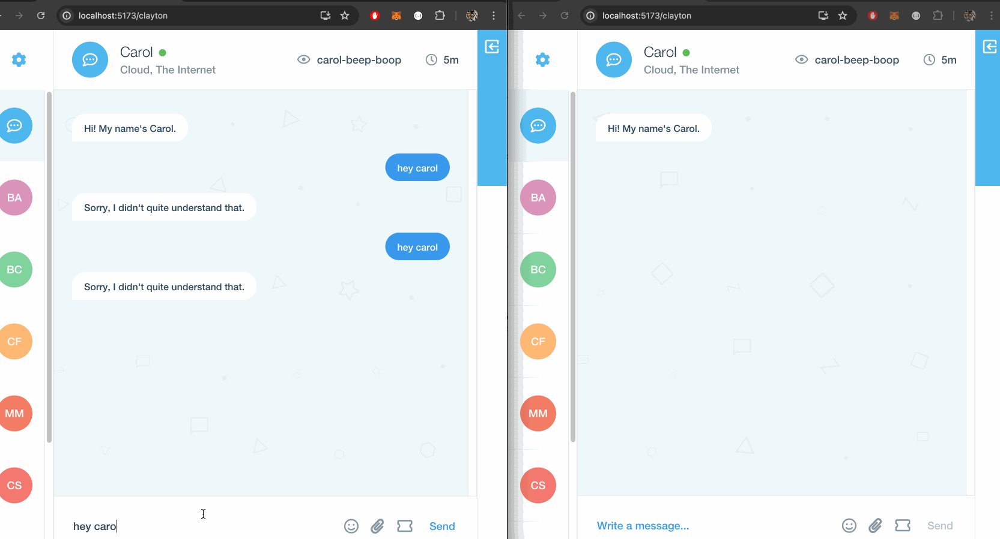

# Desafío de codificación de Chatter 🤖  

# Metas / Resultados ✨

- Para probar el conocimiento del uso de sockets (socket.io) y eventos.
- Comprensión de callbacks, hooks y function references.

# Requisitos previos ✅

Ninguno

# Requisitos 📖

La mayor parte del trabajo debe realizarse en los componentes de "Mensajes".

- Implementar hooks como `useEffect` y` useCallback` para manejar eventos
- Scroll hasta el final de la lista de mensajes al enviar / recibir un mensaje
- Muestra el mensaje inicial de Carol por defecto (se puede encontrar en `common / constants`)
- Utilice **sockets** para:

  - Envía el mensaje del usuario a Carol (Socket Server)
  - Mostrar un mensaje de escritura cuando Carol está escribiendo
  - Maneja los mensajes entrantes de Carol y muéstralos

- Que el listado de chats se obtenga mediante una llamada a la API

  - Agregar un endpoint en el servidor que permita obtener la información de los chats existentes. (sin paginación)

- Poder tener conversaciones entre dos personas.
- Tener la posibilidad de navegar entre chats y enviar mensajes a otras personas.
- En el caso que el destinatario no sea Carol, redireccionar ese mensaje al cliente correcto (si está conectado) para mostrarlo en pantalla.
- La comunicación se debe dar en los dos sentidos, como si fuese un chat.
- Nota: Una forma de autenticar a los usuarios puede ser utilizar el userId por query params.

# Eventos de pipelines

Consulte la documentación de [Carol server] para obtener más información.

- `bot-typing`: Emitido por Carol cuando están escribiendo en respuesta a un mensaje de usuario.
- `bot-message`: Emitido por Carol con una carga útil de mensaje en respuesta a un mensaje de usuario.
- `user-message`: Emitido por usted / el cliente con una carga útil de mensaje

# Clases de mensajes

Hemos proporcionado componentes y clases de "Mensaje". Aquí hay información sobre las clases.

- `.message - last`: El último mensaje de un grupo
- `.message - typing`: El mensaje que ve el usuario cuando el destinatario está escribiendo
- `.message - me`: Denota un mensaje de usuario

# Piensa en 💡

- Referencias a funciones y estado actual del hook
- Cómo interactuar con socket.io, eventos y cargas útiles
- Cómo funcionan los contextos de React

# Lo que ya se ha hecho 🏁

- Configuración de socket con el Carol server
- Todo UX y UI, incluso para mensajes.
- Todos los componentes, incluido un mensaje y un componente de mensaje de mecanografía
- Un contexto para configurar el último mensaje, que cambiará la vista previa en la lista de usuarios de la izquierda
- hooks para reproducir sonidos de envío / recepción

# Capturas de pantalla 🌄


# Lo que se hizo a partir de la base 📝

- Se implemento el envío y recepción de mensajes de Carol por usuario.
- Sabemos quien es cada usuario por el param `userId` en la URL.
- Se implemento la funcionalidad de envío de mensajes a otros usuarios.
- Se implemento la funcionalidad de cambio de chat.
- Cambio de estados en los usuarios para saber si se esta activo o no en el momento
  - Para este caso, no se hizo nada desde el backend mas que emitir los eventos de `user-connected` y `user-disconnected` para que el frontend pueda saber si un usuario esta activo o no, por ende no tiene chance de que un user que se conecto previo aparezca como online en otro que se conecto despues.
- Se agrego un endpoint en el servidor que permite obtener la información de los chats existentes.
- Se cambio bastante del codigo base, entre las cosas que se hicieron:

  - Cambio de la estructura de carpetas.
  - Cambio de react script por vite para mejorar la velocidad de desarrollo y solucionar errores para levantar la app
  - Se actualizaron varias librerias y se quitaron los snippets del json para evitar estos problemas de versionados lock vs install local.
  - Uso de path absolutos
  - Hook pattern como ciudadanos de primera clase, etc

- Ademas, se cambiaron cosas de Carol Server y agregaron nuevas funcionalidades para poder soportar ciertas funcionalidades nuevas

## Ejecucion de la app

### Antes que nada

Crear un archivo `.env.local` en la raiz del proyecto siguiendo el `.env.sample`

Luego tener el servidor de Carol corriendo en el PORT 4001 que es el por defecto.

### Para correr la app

```bash
pnpm install && pnpm dev
```

or npm, yarn lo que fuere.

### Demo 🌄


